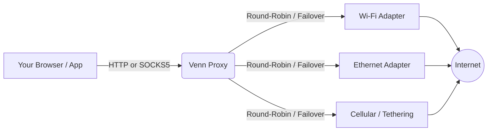

# Venn Combine Connection ⚡ - Multi-ISP Proxy Tool


**Venn Combine Connection** is a lightweight, interactive CLI tool for Windows that empowers you to aggregate multiple internet connections into a single, high-performance proxy — effectively enabling **internet bonding** and **link aggregation** at the application level.

Acting as both an **HTTP CONNECT** and **SOCKS5 proxy**, Venn intelligently distributes network traffic across all your active interfaces (Wi-Fi, Ethernet, Tethering, Cellular) to maximize bandwidth and ensure network redundancy. Think of it as a **multi-WAN load balancer** that runs entirely from your terminal.

## 🎯 Use Cases (Why use Venn?)
- **Bandwidth Aggregation / Internet Bonding:** Combine your Wi-Fi and mobile tethering to speed up heavy downloads and achieve higher throughput via connection pooling.
- **Connection Reliability & Failover:** Stream or game without interruption using the Failover mode; if your Wi-Fi drops, Ethernet/Cellular takes over instantly — true **multi-WAN redundancy**.
- **Network Engineering & Testing:** Easily test and route packets across multiple ISPs simultaneously without complex OS-level routing tables or dedicated hardware.

## 🚀 Core Features

- **Multi-Interface Load Balancing**: Seamlessly combine 2 or more active internet adapters into a unified proxy endpoint.
- **Smart Routing Strategies**:
  - **Round-Robin**: Distributes connections evenly across all selected interfaces. Ideal for load balancing and heavy browsing.
  - **Failover**: Assigns a primary interface and automatically routes traffic to secondary ones if the primary goes offline.
- **Interactive TUI (Terminal User Interface)**: A beautiful, responsive terminal dashboard built with Bubbletea for real-time monitoring and easy interface selection.
- **Deep Windows Integration**:
  - **Auto-Config**: Automatically injects proxy settings into the Windows system.
  - **Magic Restore**: Safely backs up and restores your original Windows proxy settings upon exit.
- **Dual Protocol Support**: 
  - `HTTP CONNECT` Proxy (Default: port 1080) - Universal compatibility.
  - `SOCKS5` Proxy (Default: port 1081) - For raw TCP/UDP packet routing.
- **Live Telemetry**: Track bytes sent/received and active connection counts per interface in real-time.

## ⚙️ How It Works



Venn sits between your applications and the internet as a local proxy server. When a connection request comes in, the **routing engine** selects which network adapter to use based on your chosen strategy:

1. **Round-Robin** cycles through all active interfaces, distributing load evenly.
2. **Failover** sends all traffic through your primary adapter and only switches when it detects the primary is down.

All proxy settings are automatically configured in Windows, so every app that respects system proxy settings will benefit — no per-app configuration needed.

## 🛠 Installation

### Prerequisites
- Windows OS (Windows 10/11 recommended)
- [Go](https://go.dev/dl/) 1.25 or later (Only if building from source)

### Quick Start (Binary)
1. Download the latest `venn.exe` from the [Releases](https://github.com/YudaKusumaID/multi-isp-proxy/releases) page.
2. Run the executable in your terminal (PowerShell or CMD).

### Build From Source
```powershell
# Clone the repository
git clone https://github.com/YudaKusumaID/multi-isp-proxy.git
cd multi-isp-proxy

# Build the binary
go build -o venn.exe ./cmd/

# Run the tool
.\venn.exe
```

## 📖 Usage Guide

1. **Launch**: Start `venn.exe`. *(Tip: Run with `-addr :8080` to assign a custom port).*
2. **Select Interfaces**: Use `↑/↓` arrow keys to navigate and `Space` to toggle the network adapters you want to combine. Press `a` to select all, then `Enter` to confirm.
3. **Choose Strategy**: Select between `Round-Robin` or `Failover` mode.
4. **System Auto-Proxy**: When prompted, press `Y` to automatically configure Windows to route traffic through Venn. Your original settings will be magically restored when you quit.
5. **Dashboard Controls**: Monitor traffic in real-time. Press `r` to reset statistics or `q` to safely exit the application.

## ❓ FAQ & Troubleshooting

<details>
<summary><b>How do I combine Wi-Fi and Ethernet on Windows?</b></summary>

Simply run `venn.exe`, select both your Wi-Fi and Ethernet adapters from the list, choose **Round-Robin** mode, and enable Auto-Proxy. All your internet traffic will now be distributed across both connections.
</details>

<details>
<summary><b>Does Venn actually increase my download speed?</b></summary>

Yes, but with a caveat. Venn distributes **connections** (not individual packets) across interfaces. This means multi-threaded downloads (like those from download managers or torrents) will see a real speed boost. A single-threaded download will still use one interface at a time.
</details>

<details>
<summary><b>Will Venn work with any application?</b></summary>

Venn works with any application that respects Windows system proxy settings (browsers, most download managers, etc.). For apps that don't, you can manually configure them to use `127.0.0.1:1080` (HTTP) or `127.0.0.1:1081` (SOCKS5).
</details>

<details>
<summary><b>My proxy settings weren't restored after a crash. How do I fix this?</b></summary>

Venn automatically backs up your proxy settings. If the application crashes unexpectedly, simply run `venn.exe` again and exit it gracefully with `q` — your original settings will be restored.
</details>

<details>
<summary><b>Can I use Venn as a SOCKS5 proxy for gaming or specific apps?</b></summary>

Yes! Venn exposes a SOCKS5 proxy on port `1081` by default. Configure your game or application to use `127.0.0.1:1081` as a SOCKS5 proxy to route its traffic through your combined connections.
</details>

## 🤝 Contributing

Contributions are welcome! Whether it's bug reports, feature requests, or pull requests — every bit helps.

1. **Fork** the repository.
2. **Create** your feature branch: `git checkout -b feature/amazing-feature`
3. **Commit** your changes: `git commit -m 'Add amazing feature'`
4. **Push** to the branch: `git push origin feature/amazing-feature`
5. **Open** a Pull Request.

Please check the [Issues](https://github.com/YudaKusumaID/multi-isp-proxy/issues) page for open tasks and bug reports.

## 🛡 License

This project is open-sourced software licensed under the [MIT License](LICENSE).

## 🙏 Credits & Acknowledgements

Venn is built on the shoulders of giants:
- [Bubbletea](https://github.com/charmbracelet/bubbletea) & [Lipgloss](https://github.com/charmbracelet/lipgloss) for the stunning TUI.
- [go-socks5](https://github.com/things-go/go-socks5) for the robust SOCKS5 implementation.
- [golang/sys](https://github.com/golang/sys) for low-level OS interactions.

---
<div align="center">
  Developed by <a href="https://github.com/YudaKusumaID"><b>Yuda Kusuma</b></a> <br>
  <i>Empowering open-source network engineers.</i>
</div>